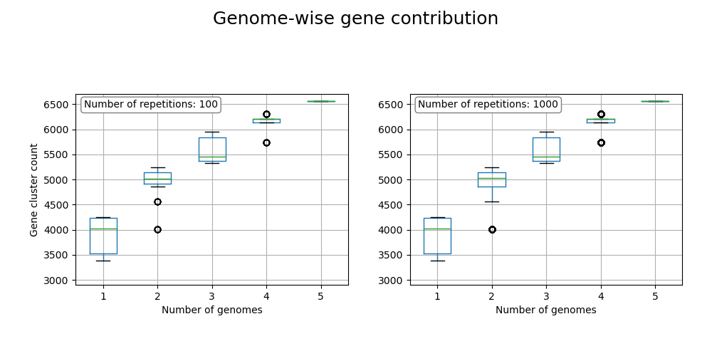

# proteinortho_pangenome
A command line tool for a pangenome analysis from proteinotho calculated cluster table and description files using python 3.8. Add gene descriptions to the tabular output of cluster tables from proteinortho calculations. Retrieve a tabular pangenome analysis of various proteinortho cluster tables of from one calculation. So now you can compare the various cluster output tables from proteinorto.  


# How to use

This is a command line tool using python version 3.8. So make sure to have python version 3.8 installed and use it as python interpreter.
To get the usage information run:
```python main.py -h```

This will display the following information:
```
usage: main.py [-h] [-i INPUTFILE [INPUTFILE ...]] [-d DESCRIPTION] [-N] [-A] [-V] [-G] [-v]

optional arguments:
  -h, --help            show this help message and exit
  -i INPUTFILE [INPUTFILE ...], --inputfile INPUTFILE [INPUTFILE ...]
                        path to tabular proteinortho output file(s) required for options -A/-G/-N/-V
  -d DESCRIPTION, --description DESCRIPTION
                        path to tabular proteinortho description file
  -N, --NAMES           add gene names to IDs for the tabular input file
  -A, --ANALYSE         tabular pangenome analysis
  -V, --VISUALIZE       visualization of the pangenome composition as pie or bar plot
  -G, --GENE_CONTRIBUTION
                        box plot of gene contribution with each genome
  -v, --version         show program version

```

# Examples

**1. ```-A/--ANALYSE```**

Here is an example for running the ```-A/--ANALYSE```-option with the cluster table form proteinortho's calculation including 5 available genomes of the genus Saccharospirillum. The second input table was retrieved by running the program with the ```-N/--NAMES```-option.

Command:
```
python main.py 
  -d Saccharospirillum.descriptions 
  -i Saccharospirillum.poff.tsv Saccharospirillum.poff.named.tsv 
  -A
```

Output:
```
                                      test/Saccharospirillum.poff.tsv  test/Saccharospirillum.poff.named.tsv
Total genes from all input genomes                              19444                                  19444
Genes in gene clusters                                          17267                                  17267
Gene clusters                                                    4379                                   4379
Unique genes                                                     2177                                   2177
Core gene clusters                                               2344                                   2344
Accessory gene clusters                                          2035                                   2035
Core genes in clusters                                          11730                                  11730
Accessory genes in clusters                                      5537                                   5537
Gene cluster with annotated function                                0                                   2566
```
\
\
\
**2. ```-V/--VISUALIZE```**

Get an overview of the pangenome by choosing the ```-V/--VISUALIZE```-option, retrieving two pie charts and two bar charts. 

Command:
```
python main.py 
  -d Saccharospirillum.descriptions 
  -i Saccharospirillum.poff.tsv
  -V
```

Output:


\
\
**3. ```-G/--GENE_CONTRIBUTION```**

The gene contribution with each genome to the pangenome is calcualted in several iterations. If at least the lines in the last two columns are at same height, no gene contribution is happening with adding a further genome, therefore the pangenome is closed. Otherwise, the pangenome is open.

Command:
```
python main.py 
  -d Saccharospirillum.descriptions 
  -i Saccharospirillum.poff.tsv
  -G
```

Output:


